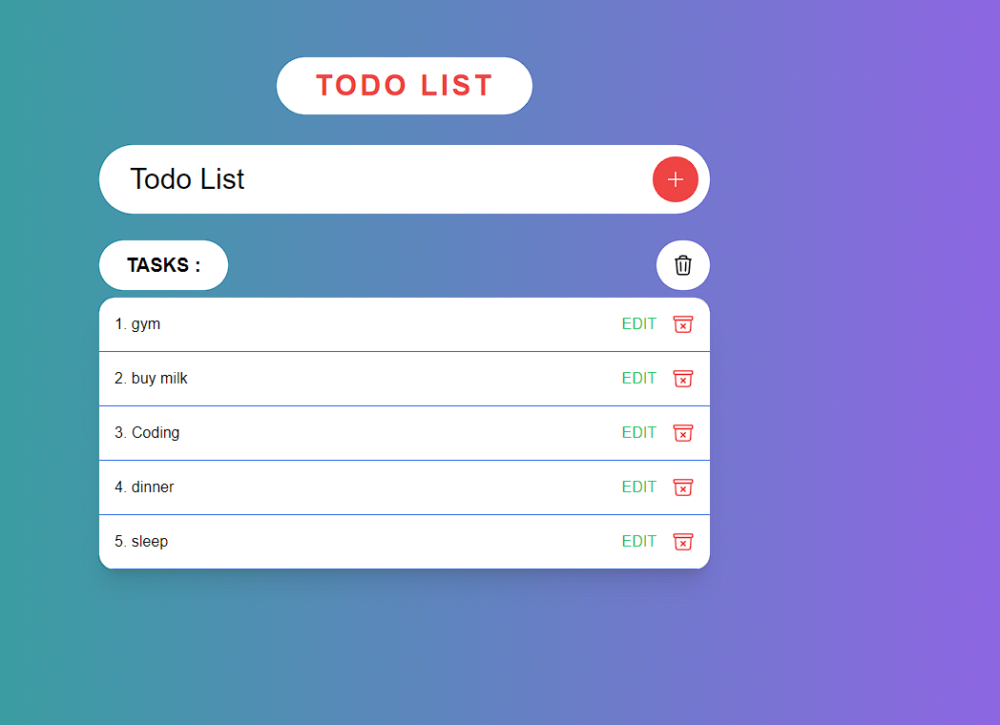

<h2 align="center">
ToDo-App<br/>

</h2>
<div align="center">
  
</div>
<h2 align="center">
  ToDo App Demo:-
  <a href="https://soumyajit.vercel.app/" target="_blank">Click Here</a>
</h2>


<br/>
<br/>

# Getting Started

1. Clone the repository:

   ```bash
   git clone https://github.com/shrikantg199/ToDo-app.git
   ```

2. Install dependencies:

   ```bash
   cd your-repository
   npm install
   ```

3. Configure the backend:

   - Follow the instructions in the backend repository to set up your server and database.

4. Start the frontend development server:

   ```bash
   npm run dev
   ```

5. Open your browser and visit [http://localhost:5173](http://localhost:5173) to view the application.
